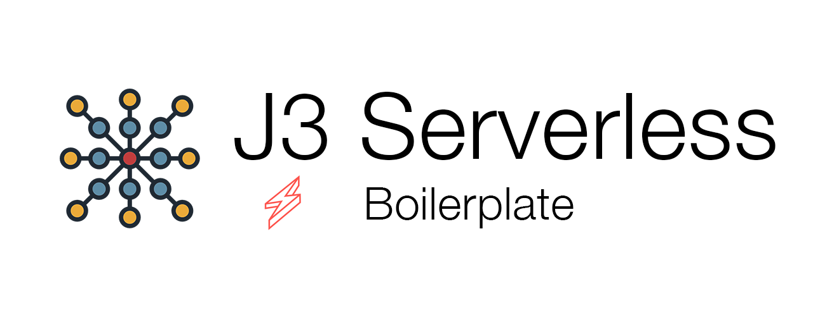

<p align="center">
    
</p>

# Jam3 Serverless Boilerplate


[](https://app.codeship.com/projects/384142)

> Boilerplate for AWS Serverless applications using serverless framework

> Icons made by <a href="https://creativemarket.com/Becris" title="Becris">Becris</a> from <a href="https://www.flaticon.com/" title="Flaticon"> www.flaticon.com</a>

---

# Table of Contents

- [Installation](#installation)
- [Usage](#usage)
- [Release](#release)
- [Contributing](#contributing)
- [License](#license)

## Installation

### 1. Clone Repository

Clone the GitHub repository or Fork it:

```
git clone https://github.com/Jam3/serverless-boilerplate.git
```

### 2. Create environment variables

Create a local environment variable file called `.env.local` based on `.env.local.example`

### 3. Start offline usage

#### Offline DynamoDB Requirements

> Note: You can skip all these requirements if remove the lambda dependencies to dynamoDB.

The boilerplate includes an example of a dynamo table and to run it offline is using the plugin `serverless-dynamodb-local`. This plugin requires `Java Runtime Engine (JRE) version 6.x or newer`.

After having JRE running on your computer, you need to install dynamodb: `sls dynamodb install`

Populate the local dynamodb running `sls dynamodb start --migrate`.

#### Running local

Navigate to the folder `npm install` and `npm start`. You _should_ now be able to navigate to `http://localhost:3000/dev/users/e716a413-7f9c-4b72-95fb-f1e13e4cf292` and see a JSON object. If NOT please consult [Getting Started Troubleshooting](https://github.com/Jam3/serverless-boilerplate/wiki/Getting-Started-Troubleshooting) in the WIKI.

## Usage

TBD: List commands in package.json

### Environment Variables Files

.env  
.env.[env]

Serverless will load this env files for local runs.

This files must be encrypted before being pushed to github:

### Encrypted Environment Variables

Create a new file `codeship.aes` on the project root folder and put the codeship `AES` key in it.

#### Encrypt

To encrypt env vars run `sh encrypt-env.sh`

#### Decrypt

To decrypt env vars run `sh decrypt-env.sh`

Reference:

- https://www.npmjs.com/package/serverless-dotenv-plugin
- https://docs.cloudbees.com/docs/cloudbees-codeship/latest/pro-builds-and-configuration/environment-variables#_encrypted_environment_variables

## Release

To releasing new versions we are using [standard-version](https://github.com/conventional-changelog/standard-version).

Steps:

1. When PRs/commits land to your master branch, select the Squash and Merge option.
2. Add a title and body that follows the [Conventional Commits Specification](https://www.conventionalcommits.org).
3. Run `$ git checkout master; git pull origin master`
4. Run `$ npm run release`
5. Run `$ git push --follow-tags origin master`

## Contributing

Please read [CONTRIBUTING.md](CONTRIBUTING.md) for details on our code of conduct, and the process for submitting
pull requests.

## License

[MIT](LICENSE)
